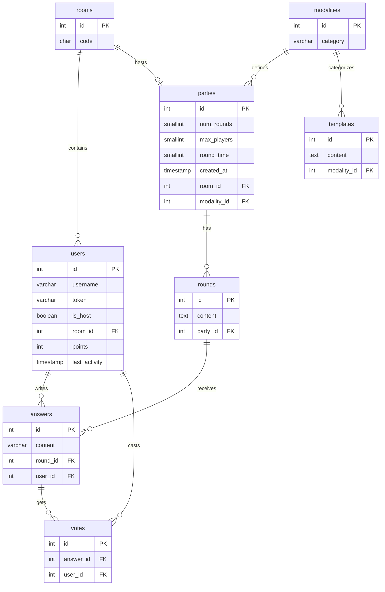

# CaptionIt

A real-time multiplayer game where creativity and humor are the keys to victory. Players join a room using a code and compete by answering absurd prompts or adding captions to random memes. Through a blind voting system, players choose the funniest response, accumulating points to determine the winner of the game.

## Installation Instructions

### Prerequisites

Before starting, ensure you have the following installed:
* **Docker** (v20.10 or higher)
* **Docker Compose** (v2.0 or higher)
* **Git**

### Environment Variables

The project uses pre-configured default values, so it works out of the box. 

If you need to customize the configuration:
1. Copy the provided example file: `cp .env.example .env`
2. Open `.env` and modify the values as needed.

*Note: The `.env` file is ignored by git to keep your local credentials secure.*

### Commands to Start

Follow these steps to spin up the entire ecosystem. The project is designed to work out of the box without manual configuration.

1. **Clone the repository** Download the project to your local machine:

```
git clone https://github.com/jllinass/CaptionIt.git
cd CaptionIt
```


2. **Configure Environment Variables (Optional)** The system uses pre-defined defaults. If you wish to customize passwords or keys, create a .env file from the template:

```
cp .env.example .env
```

If you skip this step, the project will use the default credentials defined in docker-compose.yml.

3. **Launch with Docker** Build and start all services (Database, PostgREST, SSE, and Frontend):

```
docker compose up -d --build
```

4. **Verify the status** Check if all containers are running and the database is healthy:

```
docker compose ps
```

### Access

Once the services are up and running, you can access them at the following addresses:

| Service | URL | Description |
| :--- | :--- | :--- |
| **Frontend (App)** | [http://localhost:5173](http://localhost:5173) | The main game interface (Vite + React). |
| **API REST** | [http://localhost:3000](http://localhost:3000) | PostgREST interface to the database. |
| **SSE Service** | [http://localhost:3001](http://localhost:3001) | Real-time events service (Server-Sent Events). |
| **API Docs** | [http://localhost:8084](http://localhost:8084) | Swagger UI to explore and test the API. |
| **pgAdmin** | [http://localhost:8083](http://localhost:8083) | Database management (User: `postgres@example.com`). |

---

### 🔑 Default Credentials
If you haven't changed the `.env` file, use these credentials to log in:
* **pgAdmin User:** `postgres@example.com`
* **pgAdmin/DB Password:** `captionit@1234`

## Relational Model Diagram



## Functional Requirements

* **R01. Rooms and Hosts:** Any user can create a room and become the "Host," receiving a unique 4-character access code.
* **R02. Joining the Game:** Players join using the code and a nickname. The system uses Local Storage or Cookies to allow reconnection.
* **R03. Configuration:** The Host chooses the game mode (Phrases/Images), number of rounds, response time (e.g., 60s), and player limit.
* **R04. Mode 1 (Questions):** The system displays an open-ended question and players submit anonymous answers.
* **R05. Mode 2 (Images):** A random meme or image is shown, and players must write a funny caption for it.
* **R06. Blind Voting:** Responses are shuffled to hide authorship. Players are not allowed to vote for their own submission.
* **R07. Points System:** Points are awarded for each vote received. A "United People" bonus is given if more than 80% of the room votes for the same answer.
* **R08. Real-Time Ranking:** Animated bar charts are shown after each round displaying current positions.
* **R09. End of Game:** A podium featuring the top 3 players and statistics (e.g., "Most Voted") is displayed.
* **R10. Automatic Deletion:** A cron job or timer deletes inactive rooms to optimize server resources.
